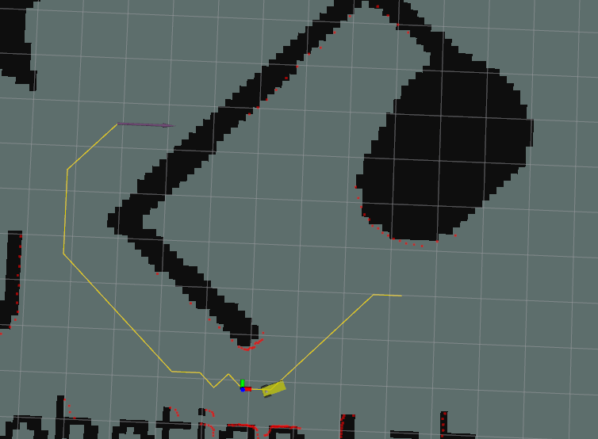

# ROS-wheeled-robot

Author: Zhixuan Liang, Fanghao Wang, Zhenze Jiang

Tutorial: [Tutorial](document/)

ROS Official Doc: [ROS](http://wiki.ros.org/ROS/Tutorials/InstallingandConfiguringROSEnvironment)

## Quick Start

```bash
git clone https://github.com/Liang-ZX/ros_wheeled_robot.git

mkdir catkin_ws
ln -s ros_wheeled_robot/plan_sim catkin_ws/src
cd catkin_ws

# build source
catkin build
source devel/setup.bash
```

1. Path planning with BFS

```bash
# create roscore in one console
roscore 

# open another console
roslaunch course_agv_nav nav.launch
```

In RViz, please use **2D Nav Goal** to indicate the target position.


